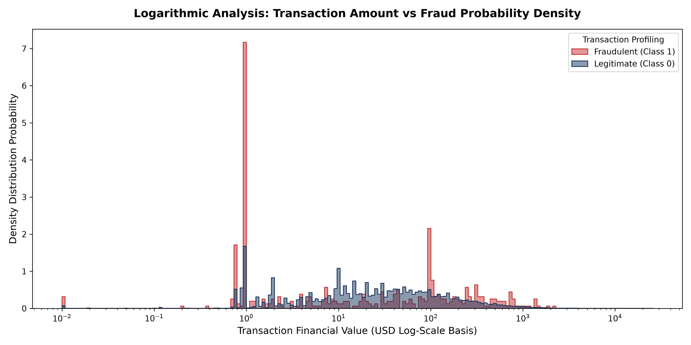

# Credit Card Fraud Detection Analysis   💳🔍

## 📊 Project Visual Preview

## 📌 Executive Summary
Engineered an end-to-end data analytics and predictive machine learning pipeline evaluating credit card transaction behavior. This project demonstrates why traditional rule-based firewall monitoring systems fail against sophisticated modern fraud vectors and provides a robust machine learning blueprint for extracting high-precision fraud triggers from heavily imbalanced datasets (0.17% minority class ratio).

* **Objective:** Maximize fraudulent transaction capture rates (Recall) while strictly controlling false-positive customer friction.
* **Tech Stack:** Python 3.x, Scikit-Learn, Pandas, NumPy, Matplotlib, Seaborn.
* **Core Dataset:** Highly imbalanced transactional log matrix optimized under the 25MB web-distribution threshold via stratified sampling (`transaction_fraud_data_small.csv`).

---

## 💡 Key Analytical Discoveries & ML Breakthroughs

### 1. The Critical Failure of Rule-Based Firewalls
* A statistical percentile analysis run on standard consumer baseline traffic established a 99th percentile upper spending limit threshold of **\$1,016.97**.
* Setting an automated firewall alert rule to flag any transaction above this amount captured **only 1.83% of true fraud cases**.
* **Business Insight:** Fraudulent anomalies intentionally mimic routine everyday consumer dollar values to escape traditional logic checks. Relying solely on amount thresholds is completely ineffective.

### 2. Machine Learning Firewall Performance
By analyzing hidden behavioral patterns across 28 anonymized PCA structural indices and deploying a **Balanced Random Forest Classifier**, the system achieved an elite performance leap:
* **Fraud Capture Rate (Recall):** **82.00%** (Successfully intercepting the vast majority of network attacks).
* **Alert Precision:** **92.00%** (Restricting false-alarm friction for legitimate users to a minimum).
* **Model Classification AUC:** **0.9673 ROC-AUC Score**.

---

## 🛠️ Code Architecture & Notebook Workflow
The complete workbook pipeline (`fraud_detection_notebook.ipynb`) contains clean execution blocks covering:
1. **Exploratory Class Density Ingestion:** Auditing minority class proportions and scanning dataset dimensions.
2. **Logarithmic Data Transformation:** Engineering overlapping distribution curves on a logarithmic financial scale to normalize massive transactional swings.
3. **Data Splitting:** Constructing stratified train-test splits to preserve rare class dimensions across evaluation channels.
4. **Machine Learning Model Training:** Deploying ensemble classification methods equipped with class-weight balances.
5. **Performance Matrices Evaluation:** Compiling precision-recall matrices and calculating Area Under the ROC Curve.
